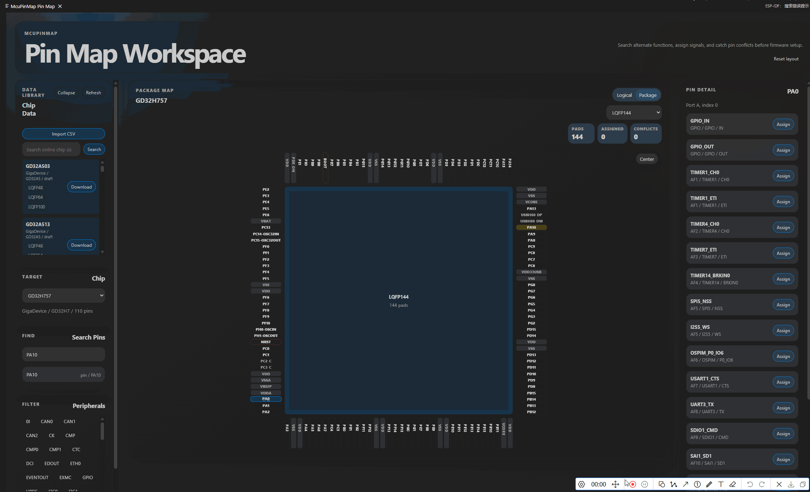

# McuPinMap

[English README](README.md)

McuPinMap 是一个轻量级 VS Code 插件，用于查询 MCU GPIO Alternate Function，并辅助规划引脚功能分配。项目优先关注逻辑 Pin Map：选择芯片、查看每个 IO 支持的功能、搜索外设信号、分配功能，并将结果导出给固件或硬件设计记录使用。

## 界面截图

<p align="center">
  
</p>

## 功能

- 按芯片浏览 GPIO Alternate Function。
- 按引脚名、Alternate Function、外设或信号搜索。
- 以 GPIO port 分组展示逻辑 Pin Map。
- 查看 LQFP 和 BGA 封装 pinout 数据。
- 为引脚分配 alternate function。
- 检测同一 pin 被重复占用，以及同一外设信号被重复分配。
- 导出 JSON 或 Markdown。
- 按需下载官方维护的芯片数据，VSIX 不内置 CSV 数据。
- 支持导入本地 CSV，用于私有、实验性或厂商特定芯片数据。

## 使用指南

在 VS Code 中打开 Pin Map 工作区：

1. 安装或运行 McuPinMap 插件。
2. 使用 `Ctrl+Shift+P` 打开命令面板。
3. 执行 `McuPinMap: Open Pin Map`。

也可以打开 VS Code 活动栏中的 McuPinMap 视图，并从其中进入 Pin Map。开发调试时，可以在 VS Code Run and Debug 面板选择 `Run Extension and Open Pin Map`，它会启动 Extension Development Host，并自动打开 Pin Map。

Pin Map 打开后：

1. 从芯片库选择或下载芯片。
2. 搜索引脚、外设、信号或 alternate function。
3. 在 Pin Detail 面板查看该引脚支持的功能。
4. 为引脚分配功能，并处理提示的冲突。
5. 将分配方案导出为 JSON 或 Markdown。

## 数据模型

插件包保持轻量。官方维护的芯片源数据放在外部数据仓库：

```text
https://github.com/GYM-png/mcupinfunc-data
```

默认情况下，McuPinMap 从下面的地址读取远程芯片索引：

```text
https://raw.githubusercontent.com/GYM-png/mcupinfunc-data/main/index.json
```

可以通过 VS Code 配置项修改索引地址：

```text
mcupinmap.remoteIndexUrl
```

芯片源数据目录结构为：

```text
chips/<vendor>/<family>/<part-number>/source/
```

运行时使用的芯片数据会在数据仓库中生成为 `chip.json`。用户下载过的芯片数据会缓存到该插件的 VS Code global storage 中。

主仓库可以保留 `data/chips/` 下的 legacy/dev/test fixture 数据，但发布 VSIX 时会排除 `data/**`、`generated/**` 和 `external-data/**`。

## CSV 格式

GPIO alternate-function CSV 使用固定的 `AF0` 到 `AF15` 表头：

```csv
PinName,AF0,AF1,AF2,AF3,AF4,AF5,AF6,AF7,AF8,AF9,AF10,AF11,AF12,AF13,AF14,AF15
```

LQFP pinout CSV 使用：

```csv
PadNumber,PinName,PinType
```

BGA pinout CSV 使用：

```csv
BallName,PinName,PinType
```

`PinType` 只能是：

```text
gpio, power, ground, reset, clock, boot, nc
```

## 开发

安装依赖：

```powershell
npm install
```

运行测试：

```powershell
npm test
```

构建 legacy fixture 数据、Extension Host 和 Webview：

```powershell
npm run build
```

只构建 Extension Host 和 Webview：

```powershell
npm run build:extension-only
```

校验 legacy fixture 芯片数据：

```powershell
npm run validate:data
```

打包不包含芯片数据的轻量 VSIX：

```powershell
npm run package:light
```

## 外部数据流程

外部数据仓库的本地 checkout 路径为：

```text
external-data/mcupinfunc-data/
```

校验外部数据 checkout：

```powershell
npm run validate:remote-data
```

生成每个芯片的 `chip.json` 和仓库根目录的 `index.json`：

```powershell
npm run build:remote-data
```

当外部数据仓库工具可用时，校验发布数据：

```powershell
npm run verify:remote-data
```

## 项目结构

```text
src/extension/    VS Code Extension Host 集成
src/shared/       共享校验、解析、索引、搜索和分配逻辑
src/webview/      React 和 Zustand Webview UI
scripts/          数据校验与构建脚本
test/             Vitest 测试
resources/        插件图标和静态资源
```

不要提交本地构建产物、依赖目录、生成的芯片数据或外部数据仓库 checkout。

## VS Code 调试

使用 `.vscode/` 下的调试配置：

- `Run Extension`
- `Run Extension and Open Pin Map`

第二个配置会启动 Extension Development Host，并尝试自动打开 Pin Map 视图。如果没有自动打开，可以在命令面板执行 `McuPinMap: Open Pin Map`。

## 许可证

MIT
